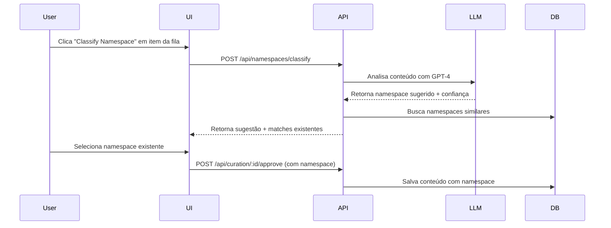
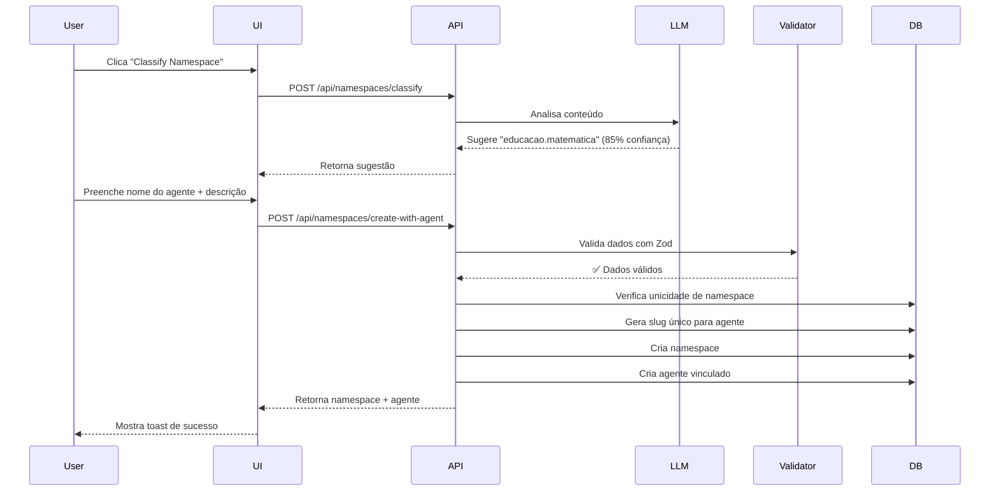

# 🎯 Guia de Classificação Automática de Namespaces

## 📋 Visão Geral

O **Sistema de Classificação Automática de Namespaces** utiliza **GPT-4** para analisar conteúdo e propor namespaces ideais automaticamente. Quando um conteúdo entra na fila de curadoria (Curation Queue), o sistema pode:

1. ✅ **Classificar** o conteúdo em um namespace existente (com validação de similaridade)
2. ✅ **Criar** um novo namespace + agente especialista automaticamente
3. ✅ **Evitar duplicatas** através de detecção de similaridade multi-métrica

## 🏗️ Arquitetura

### Componentes Principais

```
┌─────────────────────────────────────────────────────────────┐
│                    FRONTEND (React)                         │
│  ┌────────────────────────────────────────────────────────┐ │
│  │  CurationQueuePage.tsx                                 │ │
│  │  └─> NamespaceClassifier.tsx (Dialog UI)              │ │
│  └────────────────────────────────────────────────────────┘ │
└─────────────────────────────────────────────────────────────┘
                            ↕ HTTP REST API
┌─────────────────────────────────────────────────────────────┐
│                    BACKEND (Node.js)                        │
│  ┌────────────────────────────────────────────────────────┐ │
│  │  routes/namespaces.ts                                  │ │
│  │  • POST /api/namespaces/classify                       │ │
│  │  • GET  /api/namespaces/search                         │ │
│  │  • POST /api/namespaces/create-with-agent              │ │
│  └────────────────────────────────────────────────────────┘ │
│  ┌────────────────────────────────────────────────────────┐ │
│  │  services/namespace-classifier.ts                      │ │
│  │  • LLM-powered classification                          │ │
│  │  • Multi-metric similarity detection                   │ │
│  └────────────────────────────────────────────────────────┘ │
└─────────────────────────────────────────────────────────────┘
                            ↕
┌─────────────────────────────────────────────────────────────┐
│                EXTERNAL SERVICES                            │
│  • OpenAI GPT-4 (LLM classification)                        │
│  • PostgreSQL (namespaces + agents storage)                 │
└─────────────────────────────────────────────────────────────┘
```

## 🔄 Fluxo de Trabalho

### Cenário 1: Classificar em Namespace Existente



### Cenário 2: Criar Novo Namespace + Agente



## 🧠 Análise LLM (GPT-4)

### Prompt de Classificação

O sistema envia o seguinte prompt para GPT-4:

```
Você é um assistente especializado em classificação de conhecimento.
Analise o conteúdo abaixo e sugira um namespace ideal em formato hierárquico usando pontos.

TÍTULO: {título do conteúdo}

CONTEÚDO:
{texto completo}

INSTRUÇÕES:
1. Use formato flat com pontos (ex: "educacao.matematica", "tecnologia.ia", "saude.nutricao")
2. Máximo 3 níveis hierárquicos
3. Apenas letras minúsculas, números e pontos
4. Evite abreviações
5. Seja específico mas não excessivamente granular

NAMESPACES EXISTENTES NO SISTEMA:
{lista de namespaces já existentes}

Responda em JSON:
{
  "suggestedNamespace": "categoria.subcategoria",
  "confidence": 85,
  "reasoning": "Explique por que este namespace é ideal"
}
```

### Exemplo de Resposta LLM

```json
{
  "suggestedNamespace": "educacao.matematica.geometria",
  "confidence": 92,
  "reasoning": "O conteúdo aborda especificamente teoremas de geometria euclidiana, incluindo demonstrações do Teorema de Pitágoras e propriedades de triângulos. O namespace educacao.matematica.geometria é o mais apropriado por ser específico o suficiente para organização eficiente, mas não excessivamente granular."
}
```

## 🔍 Detecção de Similaridade

### Algoritmo Multi-Métrica

O sistema usa **2 métricas combinadas** para detectar namespaces similares:

#### 1. Distância de Levenshtein Normalizada

```typescript
// Calcula quantas edições são necessárias para transformar A em B
const distance = levenshteinDistance(namespaceA, namespaceB);
const maxLength = Math.max(namespaceA.length, namespaceB.length);
const similarity = 1 - (distance / maxLength); // 0.0 a 1.0
```

**Exemplo:**
- `educacao.matematica` vs `educacao.matematica.geometria` → **82% similar**
- `tecnologia.ia` vs `tecnologia.inteligencia` → **64% similar**

#### 2. Word Overlap (Sobreposição de Palavras)

```typescript
// Conta quantas palavras são compartilhadas entre os namespaces
const wordsA = namespaceA.split(/[.\-_]/);
const wordsB = namespaceB.split(/[.\-_]/);
const commonWords = intersection(wordsA, wordsB);
const similarity = (2 * commonWords.length) / (wordsA.length + wordsB.length);
```

**Exemplo:**
- `saude.nutricao` vs `saude.nutricao.infantil` → **67% overlap**
- `tecnologia.web` vs `tecnologia.mobile` → **50% overlap**

#### 3. Similaridade Final (Média Ponderada)

```typescript
const finalSimilarity = (levenshtein * 0.6) + (wordOverlap * 0.4);
```

**Threshold:** Namespaces com similaridade ≥ **60%** são considerados "matches potenciais".

## 📝 Validação de Dados (Zod)

### Schema de Criação de Namespace + Agente

```typescript
const createWithAgentSchema = z.object({
  namespaceName: z.string()
    .min(3, "Namespace deve ter no mínimo 3 caracteres")
    .max(100, "Namespace deve ter no máximo 100 caracteres")
    .regex(/^[a-z0-9]+(\.[a-z0-9]+)*$/, {
      message: "Formato inválido. Use letras minúsculas, números e pontos apenas"
    }),
  description: z.string()
    .min(10, "Descrição deve ter no mínimo 10 caracteres")
    .max(500, "Descrição deve ter no máximo 500 caracteres"),
  agentName: z.string()
    .min(3, "Nome do agente deve ter no mínimo 3 caracteres")
    .max(100, "Nome do agente deve ter no máximo 100 caracteres"),
  agentDescription: z.string()
    .min(10, "Descrição do agente deve ter no mínimo 10 caracteres")
    .max(500, "Descrição do agente deve ter no máximo 500 caracteres"),
  icon: z.string().optional()
});
```

### Regras de Validação

| Campo | Min | Max | Formato |
|-------|-----|-----|---------|
| **namespaceName** | 3 | 100 | `^[a-z0-9]+(\.[a-z0-9]+)*$` |
| **description** | 10 | 500 | Texto livre |
| **agentName** | 3 | 100 | Texto livre |
| **agentDescription** | 10 | 500 | Texto livre |
| **icon** | - | - | Emoji ou URL (opcional) |

### Exemplos Válidos vs Inválidos

✅ **Válidos:**
- `educacao.matematica`
- `tecnologia.ia.machine.learning`
- `saude.nutricao123`

❌ **Inválidos:**
- `Educação.Matemática` (letras maiúsculas)
- `educacao_matematica` (underscores não permitidos)
- `ed` (menos de 3 caracteres)

## 🔒 Garantia de Unicidade de Slug

### Algoritmo de Geração de Slug Único

```typescript
// 1. Gerar slug base a partir do namespace
let baseSlug = namespaceName.replace(/\./g, '-');
// Exemplo: "educacao.matematica" → "educacao-matematica"

// 2. Verificar unicidade e adicionar sufixo se necessário
let slug = baseSlug;
let suffix = 1;

while (true) {
  const existingAgent = await db
    .select()
    .from(agents)
    .where(eq(agents.slug, slug))
    .limit(1);

  if (existingAgent.length === 0) {
    break; // Slug disponível!
  }

  // Slug já existe, adicionar sufixo
  slug = `${baseSlug}-${suffix}`;
  suffix++; // -1, -2, -3, etc.
}
```

### Exemplos de Resolução de Colisões

| Tentativa | Namespace | Slug Gerado | Status |
|-----------|-----------|-------------|--------|
| 1 | `educacao.matematica` | `educacao-matematica` | ✅ Disponível |
| 2 | `educacao.matematica` | `educacao-matematica-1` | ✅ Disponível |
| 3 | `educacao.matematica` | `educacao-matematica-2` | ✅ Disponível |

**Nota:** O algoritmo previne colisões entre namespaces que geram o mesmo slug:
- `educacao.matematica` → `educacao-matematica`
- `educacao-matematica` (se existisse) → `educacao-matematica-1`

## 🎨 Interface do Usuário

### Componente: NamespaceClassifier.tsx

#### Estados do Dialog

1. **Inicial (Classificando)**
   ```
   ┌─────────────────────────────────┐
   │  🔄 Classificando namespace...  │
   │  ⏳ Analisando conteúdo com IA  │
   └─────────────────────────────────┘
   ```

2. **Resultado da Classificação**
   ```
   ┌─────────────────────────────────────────────┐
   │  Namespace Sugerido: educacao.matematica    │
   │  Confiança: 85% 🟢                          │
   │                                             │
   │  Namespaces Similares Existentes:           │
   │  ┌─────────────────────────────────────┐   │
   │  │ educacao.fisica (78% similar)       │   │
   │  │ tecnologia.educacao (62% similar)   │   │
   │  └─────────────────────────────────────┘   │
   │                                             │
   │  ☐ Usar namespace existente                │
   │  ☑ Criar novo namespace                    │
   │                                             │
   │  Nome do Agente: [Especialista Matemática] │
   │  Descrição: [Ensino de conceitos...]       │
   │                                             │
   │  [Cancelar]  [Criar Namespace + Agente]    │
   └─────────────────────────────────────────────┘
   ```

3. **Criando Namespace**
   ```
   ┌─────────────────────────────────┐
   │  ✨ Criando namespace...         │
   │  ⏳ Salvando no banco de dados  │
   └─────────────────────────────────┘
   ```

4. **Sucesso**
   ```
   ┌─────────────────────────────────────────┐
   │  ✅ Namespace criado com sucesso!       │
   │  Agente "Especialista Matemática" está  │
   │  pronto para uso!                       │
   └─────────────────────────────────────────┘
   ```

### Badge de Confiança

O sistema usa cores diferentes baseadas no nível de confiança:

- 🟢 **≥ 80%**: Verde (alta confiança)
- 🟡 **60-79%**: Amarelo (média confiança)
- 🔴 **< 60%**: Vermelho (baixa confiança)

```typescript
const getConfidenceBadgeVariant = (confidence: number) => {
  if (confidence >= 80) return 'success'; // Verde
  if (confidence >= 60) return 'warning'; // Amarelo
  return 'destructive'; // Vermelho
};
```

## 🛡️ Tratamento de Erros

### Tipos de Erro

| Código HTTP | Tipo | Tratamento Frontend |
|-------------|------|---------------------|
| **400** | Validação Zod | Mostra campos inválidos em vermelho |
| **409** | Namespace já existe | Sugere usar namespace existente |
| **500** | Erro LLM/DB | Toast de erro + log no console |
| **503** | OpenAI indisponível | Fallback para classificação manual |

### Exemplo de Erro de Validação

```json
{
  "error": "Validation error",
  "details": [
    {
      "code": "too_small",
      "minimum": 3,
      "path": ["namespaceName"],
      "message": "Namespace deve ter no mínimo 3 caracteres"
    }
  ]
}
```

### Fallback Manual

Se a classificação LLM falhar, o usuário pode:

1. **Selecionar** um namespace existente da lista
2. **Criar** manualmente digitando o namespace desejado

## 📊 Métricas e Performance

### Tempo Médio de Operação

| Operação | Tempo Médio | Timeout |
|----------|-------------|---------|
| Classificação LLM | 2-3 segundos | 30s |
| Busca de similaridade | 50-200ms | 5s |
| Criação namespace+agente | 100-300ms | 10s |
| **Total end-to-end** | **3-5 segundos** | - |

### Otimizações Aplicadas

1. ✅ **Top-K Limiting**: Similaridade calcula apenas top 200 namespaces
2. ✅ **Caching**: Resultados de classificação podem ser cacheados (futuro)
3. ✅ **Índices DB**: Índices em `namespaces.name` e `agents.slug`

## 🔮 Melhorias Futuras (Sugestões do Architect)

### 1. DB-Level Unique Constraint

**Problema:** Condição de corrida se 2 usuários criarem namespace simultaneamente.

**Solução:**
```sql
ALTER TABLE agents
ADD CONSTRAINT unique_agent_slug UNIQUE (slug);
```

### 2. Índices de Performance

**Para busca de similaridade:**
```sql
CREATE INDEX idx_namespaces_name_trgm ON namespaces USING gin (name gin_trgm_ops);
```

### 3. Monitoramento de Métricas

**Métricas a coletar:**
- Taxa de sucesso de classificação LLM
- Distribuição de confiança (quantos % ficam em cada faixa)
- Tempo médio de criação de namespace
- Quantidade de colisões de slug por dia

## 📚 Exemplos de Uso

### Exemplo 1: Conteúdo Educacional

**Input:**
```
Título: "Teorema de Pitágoras - Demonstração Completa"
Conteúdo: "O Teorema de Pitágoras afirma que em um triângulo retângulo..."
```

**Classificação LLM:**
```json
{
  "suggestedNamespace": "educacao.matematica.geometria",
  "confidence": 92,
  "reasoning": "Conteúdo específico sobre geometria euclidiana"
}
```

**Namespace Similares Encontrados:**
- `educacao.matematica` (85% similar)
- `educacao.fisica.mecanica` (45% similar)

**Decisão do Usuário:** Criar novo namespace `educacao.matematica.geometria`

**Agente Criado:**
```json
{
  "id": 42,
  "name": "Especialista em Geometria",
  "slug": "educacao-matematica-geometria",
  "type": "specialist",
  "namespaces": ["educacao.matematica.geometria"],
  "systemPrompt": "Você é um especialista em educacao.matematica.geometria. Ensina conceitos de geometria euclidiana, trigonometria e demonstrações matemáticas."
}
```

### Exemplo 2: Conteúdo Tecnológico

**Input:**
```
Título: "Introdução a Redes Neurais Convolucionais"
Conteúdo: "CNNs são arquiteturas de deep learning especializadas em visão computacional..."
```

**Classificação LLM:**
```json
{
  "suggestedNamespace": "tecnologia.ia.deep.learning",
  "confidence": 88,
  "reasoning": "Conteúdo técnico sobre arquiteturas de redes neurais profundas"
}
```

**Namespace Similares Encontrados:**
- `tecnologia.ia.machine.learning` (72% similar)
- `tecnologia.dados.analytics` (38% similar)

**Decisão do Usuário:** Usar namespace existente `tecnologia.ia.machine.learning`

## 🎓 Boas Práticas

### Definindo Namespaces Eficazes

✅ **Boas práticas:**
- Use hierarquia clara: `area.subarea.especialidade`
- Evite mais de 3 níveis de profundidade
- Seja específico mas não excessivamente granular
- Use termos em português (ex: `educacao`, não `education`)

❌ **Evite:**
- Namespaces muito genéricos (`conteudo`, `geral`)
- Abreviações confusas (`ed.mat` ao invés de `educacao.matematica`)
- Hierarquias muito profundas (`educacao.matematica.geometria.euclidiana.plana.triangulos`)

### Quando Criar Novo Namespace vs Usar Existente

**Criar novo namespace quando:**
- Conteúdo representa área distinta de conhecimento
- Necessita agente com expertise específica
- Volume esperado justifica categorização separada

**Usar namespace existente quando:**
- Conteúdo se encaixa perfeitamente em categoria existente
- Similaridade > 70% com namespace existente
- Diferença é apenas nível de especificidade

## 🔧 Troubleshooting

### Problema: Classificação LLM retorna namespace inválido

**Sintoma:** Erro 400 "Invalid namespace format"

**Causa:** LLM ocasionalmente retorna formato com letras maiúsculas ou caracteres especiais

**Solução:** Sistema normaliza automaticamente:
```typescript
const normalized = suggestion
  .toLowerCase()
  .replace(/[^a-z0-9.]/g, '');
```

### Problema: Namespace já existe (409)

**Sintoma:** Toast "Namespace já existe"

**Causa:** Usuário tenta criar namespace duplicado

**Solução:** Sistema sugere usar namespace existente ou adicionar sufixo

### Problema: Slug collision infinito

**Sintoma:** Loop infinito na geração de slug

**Causa:** Bug no while loop (improvável devido a suffix increment)

**Solução:** Adicionar timeout de segurança:
```typescript
let attempts = 0;
while (attempts < 100) {
  // ... verificação de unicidade
  attempts++;
}
```

## 📖 Referências

- **Levenshtein Distance:** [Wikipedia](https://en.wikipedia.org/wiki/Levenshtein_distance)
- **OpenAI GPT-4 API:** [Documentação oficial](https://platform.openai.com/docs)
- **Zod Validation:** [Zod Documentation](https://zod.dev)
- **PostgreSQL Unique Constraints:** [PostgreSQL Docs](https://www.postgresql.org/docs/current/ddl-constraints.html)

---

## 📞 Suporte

Para dúvidas ou problemas:
1. Verifique logs do backend: `/tmp/logs/`
2. Consulte métricas no Admin Dashboard
3. Revise este guia para padrões de uso

**Última atualização:** Novembro 2025
**Versão:** 1.0.0
